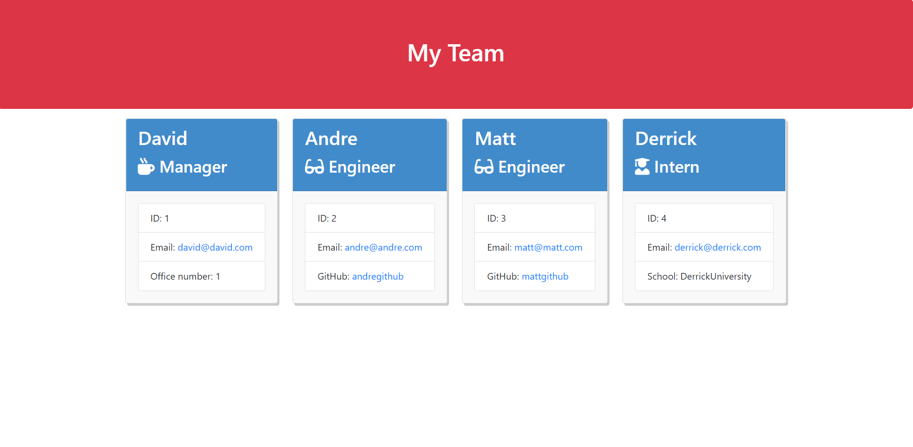

# TemplateEngine

In this repository I created a Node CLI application that generates a development team specified by the user. It uses Inquirer to prompt the user with a variety of questions. After the questions, according to the input given by the user, an HTML document is created. It also includes tests for the application.

